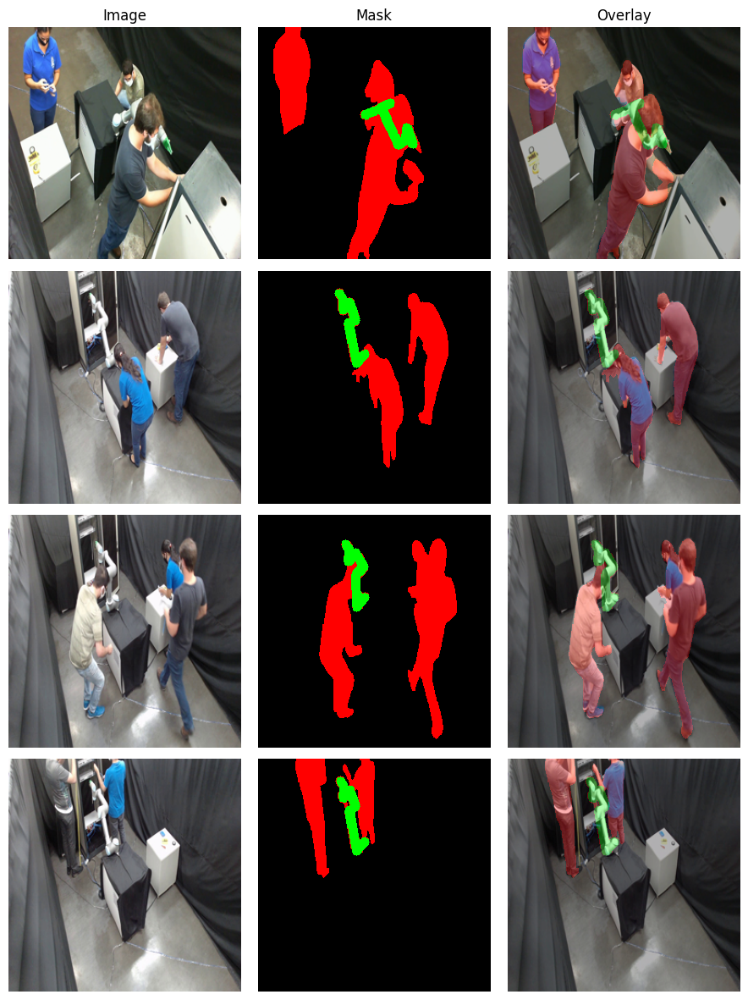

# MIRC Dataset

MIRC is a synchronized multi-view RGB dataset designed to support research on safety-aware visual perception for human-robot collaboration (HRC). It focuses on industrial maintenance scenarios in which a UR5 robotic manipulator operates in close proximity to up to three human participants performing networking-equipment routines. The experimental environment was structured to approximate maintenance operations in data centers and radio base stations, providing controlled yet realistic interaction patterns.

Data were acquired from four calibrated high-definition RGB viewpoints, enabling multi-view analysis of temporally continuous human-robot interactions. The sequences include frequent proximity events, significant inter-object occlusions, multi-person configurations, and supervised physical contact episodes, offering challenging conditions for evaluating perception and safety-monitoring pipelines.

For pixel-level supervision, MIRC includes dense semantic segmentation masks with three categories: `background`, `human`, and `robot`. These annotations enable the extraction of geometric and spatial cues from image data, supporting downstream tasks such as human-robot separation analysis, clearance estimation, collision-risk detection, safety-state classification, and temporal forecasting of hazardous interactions.

You can see the main MIRC dataset webpage for download at Hugging Face: https://huggingface.co/datasets/iagorrs/mirc

### Download and Setup Dataset

1. You can clone this repository to handle MIRC dataset and navigate to it:
> git clone https://github.com/iagorichard/mirc-dataset.git
> 
> cd mirc-dataset

2. Download the images and annotations:
> curl -L -o annotations.zip https://huggingface.co/datasets/iagorrs/mirc/resolve/main/annotations.zip
> 
> curl -L -o videos.zip https://huggingface.co/datasets/iagorrs/mirc/resolve/main/videos.zip

3. Unzip downloaded files:
> unzip annotations.zip -d annotations
>
> unzip videos.zip -d videos

4. Remove zip files after unziped them:
> rm annotations.zip
>
> rm videos.zip

5. Finally, you will see the folders "annotations", "videos", and scripts.

### Preparing Data

MIRC dataset has videos that internally combine a mosaic of 4 images in each frame (AKA supervideos). To handle this (crop + frame extraction), please follow these steps:

1. Go to scripts folder.

> cd scripts

2. Run the script to read all videos, crop and extract all frames.

> python video_cropper_release.py

3. Wait for the process finish, then the dataset is ready to use.
